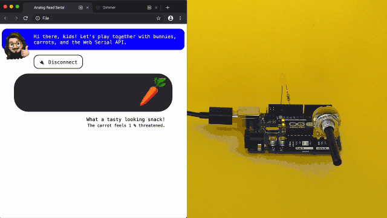

# Web Serial API Examples

The Web Serial API makes it possible for web browsers to read and write from serial devices. Soon you can chat with Arduinos, Raspberry Pis and most any device that speaks serial – straight from your website and no drivers needed. The Serial API specification is, as of this writing, not a W3C standard but you can already play with it in the latest beta versions of Chrome and Edge.

This repository is my playground for evaluating this upcoming API. If you possess an Arduino, you can play along too.

> Reading analog input, using a potentiometer, and dimming an LED from the browser.

## Before Playing With the Serial API

Make sure you have the following to play along at home:

1. Arduino compatible device and USB cable
2. [Arduino IDE][ide]
3. Beta version of [Chrome][chrome] or [Edge][edge]
4. Experimental Web Platform features enabled

After installing your browser of choice, launch it, and enable the [Experimental Web Platform features flag][flag].

## Serial API Examples

The course of action is the same for toying with all examples. Load one of the includes examples on your device using the Arduino IDE, build the associated circuit, and then point your browser to the example you want to explore.

## Analog Read Serial

Open the built-in example sketch `01.Basics → AnalogReadSerial` in the Arduino IDE and upload it to your device. Follow the tutorial to [connect a potentiometer to the Arduino][analogtutorial]. Make sure your circuit works by using the [Serial Monitor][serialmonitor].

Visit my [Analog Read Serial example page][analog].

## Dimmer

Open the built-in example sketch `04.Communication → Dimmer` in the Arduino IDE and upload it to your device. Follow the tutorial to [connect an LED to the Arduino][dimmertutorial]. Make sure your circuit works by using the [Serial Monitor][serialmonitor].

Visit my [Dimmer example page][dimmer].

[ide]: https://www.arduino.cc/en/Main/Software
[chrome]: https://www.google.com/chrome/beta/
[edge]: https://www.microsoftedgeinsider.com/en-us/download
[flag]: chrome://flags/#enable-experimental-web-platform-features
[analog]: https://svendahlstrand.github.io/web-serial-api/analog-read-serial.html
[analogtutorial]: https://www.arduino.cc/en/Tutorial/AnalogReadSerial
[dimmer]: https://svendahlstrand.github.io/web-serial-api/dimmer.html
[dimmertutorial]: https://www.arduino.cc/en/Tutorial/Dimmer
[serialmonitor]: https://www.arduino.cc/en/guide/environment#toc12
